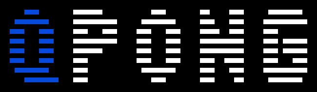

# QPong

QPong is a quantum re-imagination of the classic video game Pong. It uses [Qiskit](https://github.com/Qiskit/qiskit), IBM’s open source framework for making software for quantum computers. QPong let you explore unfamiliar yet fundamental concepts of quantum computing, such as superposition and measurement in a familiar and fun setting.

This game was initiated in IBM Qiskit Camp 2019 by [Huang Junye](https://github.com/HuangJunye), Jarrod Reilly, Anastasia Jeffery and [James Weaver](https://github.com/JavaFXpert). (The original Python version can be found [here](https://github.com/HuangJunye/QPong))  This port over to Unity was developed by [Huang Junye](https://github.com/HuangJunye), [Gregory Boland](https://github.com/boland25), & [Ivan Duran](https://github.com/filemaster).

## Story
In the dawn of the Quantum Era, a primitive 3-qubit Quantum Computer is trying to challenge the Classical Computer, the long-time ruler of the Computer Empire. Your mission is to use your Human Intelligence to help the Quantum Computer defeat the Classical Computer and demonstrate "quantum supremacy" for the first time in human history. The battle field of the Quantum-Classic war is none other than the classic Pong game.

## Installation
Download the last [release](https://github.com/HuangJunye/QPong-Unity/releases) and unzip the files to the "Downloads" folder on your computer. You need to run the `QPong-Python-Server` before runing QPong game. To do that you need to install Python and three required packages. You will also need to run the server in command line tool (Command Prompt for Windows or Terminal for macOS).

### Install Python
If you don't have Python installed on you computer, you can install Python from https://www.python.org/ or install Anaconda from https://www.anaconda.com

### Open command line tool
On Windows, open Command Prompt by typing "Command Prompt" on the search box of Start menu. Check this link if you are not sure about how to do that: https://www.wikihow.com/Open-the-Command-Prompt-in-Windows

On macOS, press Command + Space to open Spotlight. Type "Terminal" on Spotlight to open Terminal. Check this link if you are not sure about how to do that: https://www.wikihow.com/Open-a-Terminal-Window-in-Mac

### Install required packages
The Python libraries that you need to use are `qiskit`, `flask`, and `json_tricks`. To install these python libraries, `cd` to `QPong-Python-Server` in the command line and run 

    pip install -r requirements.txt

The Python server lives in a subfolder of the project.  `cd` to `QPong-Python-Server/flask_server` and run 

    python3 server.py
    
### Run the game and have fun!
With Python server running on command line tool, you can run QPong by double clicking the game icon (QPong Arcade.exe for Windows, QPong Arcade application for macOS)

## How to play
Press "S" to start the game from title screen.

Use A/Left and D/Right to select qubit.

Press X to add/remove X gate and H to add/remove H gate.

Paddle position is determined by the quantum state of the 3 qubits. Nothing fancy happens if you only use X gate. Try H gate to see cool quantum superposition.

## Credits
### QPong Python version
James Weaver: Mentoring, Created [Qiskit-Pygame framework](https://github.com/JavaFXpert/quantum-circuit-pygame)

Huang Junye: Programming, Project Management

Jarrod Reilly: Programming, Quantum Physics Consulting

Anastasia Jeffery: UX Design

### QPong Unity Version
Gregory Boland: Project Management, Arcade Machine Integration

Huang Junye: Game Design, Programming

Ivan Duran: Unity Expert

### SFX and font
Sound effects are made by NoiseCollector from Freesound.org: https://freesound.org/people/NoiseCollector/packs/254/
Font used in the game is Bit5x3 made by Matt LaGrandeur: http://www.mattlag.com/bitfonts/
